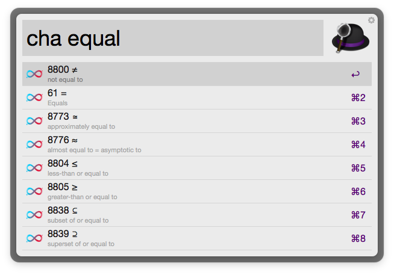

## Alfred ASCII Search

Search for ASCII characters by name or by number.

Once found you can:
* `<enter>` -  Copy the **character** to your clipboard.
* `<ctrl><enter>` - Copy **number** to your clipboard.
* `<shift><enter>` - Copy **HTML** to your clipboard.
